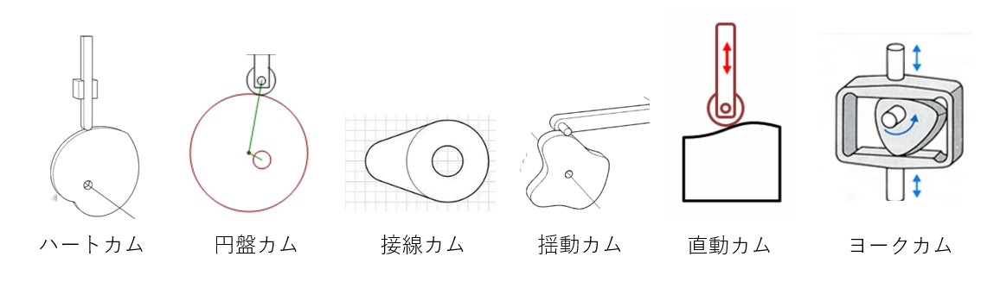
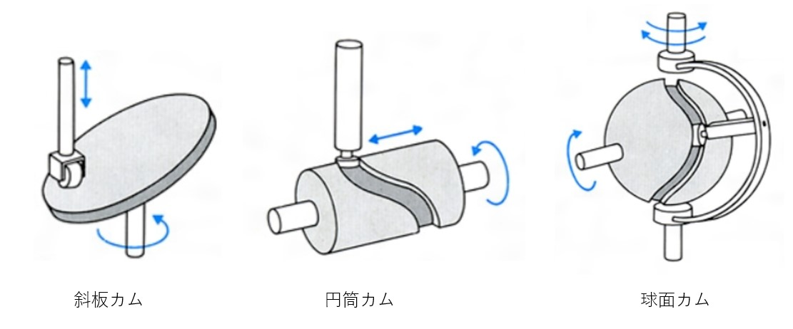

# カム機構について
カム機構とは、特殊な形状をもつ**カム**という原動節に回転運動または直線運動を与えて、従動節に往復運動をさせる装置のことである。

## カム機構の種類
カム機構には大きく２つ、平面カムと立体カムに分かれる。

## 平面カム
平面カムは厚みがないわけではなく、２次元的に表せる機構のことだ。下の写真は、代表的なカム機構の図である。

## 立体カム
立体カムは、３次元的な動きで表現するカムである。

## カム機構の設計のしかた
カム機構の形状は、欲しい動きから設計するのが望ましい。この時使用するのが、**カム変位線図**である。カム変位線図は、原動節の変位に対しての従動節の変位の関係を表した図である。

[スライダクランク機構](about-slider-crank.md) <= 前へ　|　次に => 

[シラバスに戻る](syllabus.md)