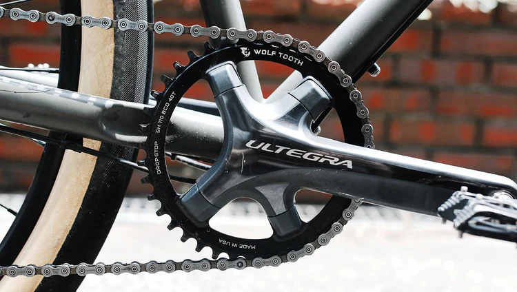
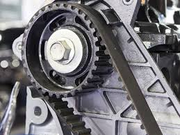

# チェーンとベルトについて
回転を伝達するにあたって、歯車以外の方法で回転を伝達することが出来る。

#### チェーン

回転の伝達で使われるチェーンとは主に自転車で使われている物を思い浮かべればよい。チェーンを扱う上で必要な用語は、「スプロケット」だ。スプロケットとは、チェーンにかみ合って回転を伝える部品のことである。自転車で言うとペダルについている歯車のような部品や後輪についている歯車のような部品である。
#### タイミングベルト

タイミングベルトとは、ゴム製のベルトの中にワイヤが通っているもので、タイミングギアで伝達できる。

# 注意事項
チェーンやタイミングベルトを用いるときには、最低以下の３つのことに気を付けなければならない。
#### テンション
テンションとは、チェーンやベルトの張り具合のことである。もちろんテンションがかかっていないときには、スプロケットやタイミングギアがかみ合わず空回りしてしまう。なので、設計をするうえでチェーンやベルトを用いる場合は、**原則テンショナを付けること**。テンショナとは、テンションをネジなどで機構的に引っ張ったりすることでテンションを調節できるようにしたもののことである。
#### チェーンやベルトにかかる力
チェーンやベルトには引っ張る力がかかる。かかる力はモーメントの計算から算出できる。どの部品にも対応している荷重があるので、それの範囲内でとどめることが望ましい。なので、かけたい力から逆算してベルトやチェーンを選定する必要がある。
#### 速度伝達比
スプロケットやタイミングギアの大きさが原動車と従動車の間で差が生まれたら、そこで回転速度が変わる。この変わり具合は、歯車と同じ速度伝達比で求められる。

[歯車について](about-gears.md) <= 前へ　　次に => [リンク機構とは](about-link-mechanism.md)
[シラバスに戻る](design-team-syllabus.md)　[ホームにもどる](design-team-home.md)