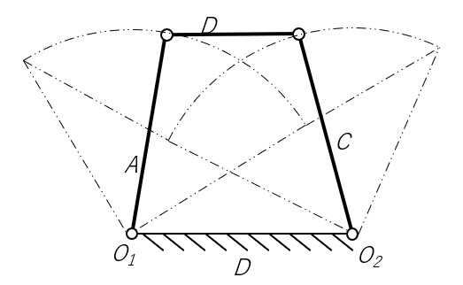

# 両てこ機構について
両てこ機構は、最短リンク B に向かい合ったリンク D を固定したときにできる機構だ。２つのリンク A とリンク C はてこの動きをする。

[両クランク機構について](about-double-crank.md) <= 前へ　|　次に => [往復スライダクランク機構について](about-slider-crank.md)

[シラバスに戻る](syllabus.md)