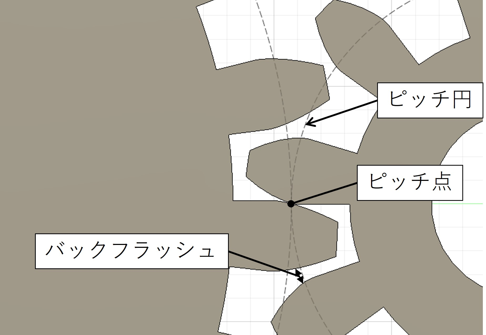
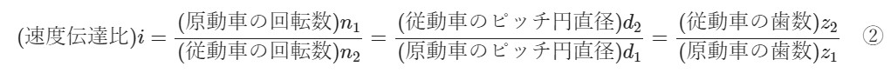
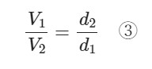
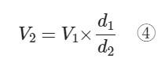
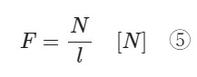
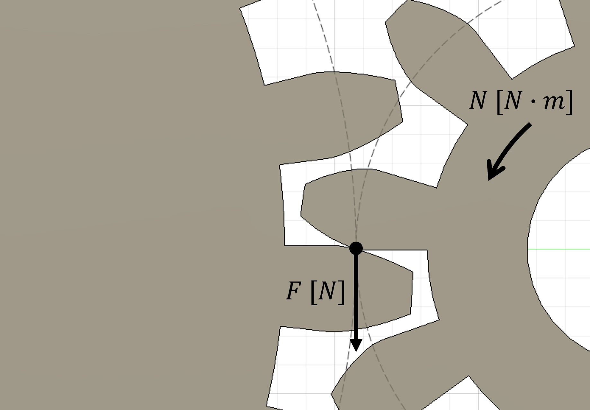
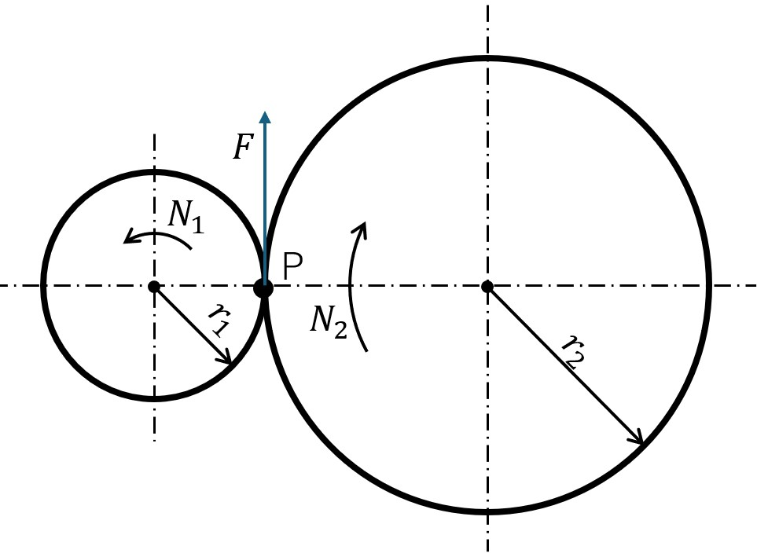

# 歯車について
ここでは歯車の基礎的な理論について説明する。
# 歯車についての用語
歯車についての細かい用語はたくさんあるが、最低限知っておかなければならないものをまとめた。図に書き込めるものは図１にまとめた。

#### ピッチ円
　ピッチ円とは、一対のかみ合う歯車は互いに接している円筒に置き換えられ、この円筒の断面円のことをいう。ようは、このピッチ円もとにモジュールを決める。
#### ピッチ点
　ピッチ点とは、かみ合う歯のピッチ円どうしの接点のこと。
#### バックフラッシュ
　バックフラッシュとは、歯車の回転を滑らすために歯と歯の間にある多少のあそびのこと。
#### モジュール
　モジュール d [mm] は、ピッチ円の直径 d [mm] を歯数 z [枚] で割ったもののこと。これは、歯の大きさを表す尺度の一つで、値が大きいほど歯も大きくなる。（式１）
m = d / z 　[mm]　①

　
　図１　歯車の用語

# 歯車の理論
歯車を使う上で、知っておかなければならない知識をまとめた。
#### 速度伝達比
　歯車を用いると、歯車の回転速度や力の増幅などができる。速度伝達比は組み合わさっている２つの歯車での運動の変わり具合を表す数字である。（式２）
　
#### 回転速度の変化
　歯車の回転速度の変化は感覚的にもわかりやすい。原動車の直径を d_1 回転数を V_1 、従動車の直径を d_2 回転数を V_2とするとき、d_1 とd_2 の関係式は ③ のようになっている。（式３）
　
　式３を$V_2$ について解くと、従動車の回転数は原動車の何倍になるかがわかる。（式４）
　
#### モーメントの伝達
　歯車では、基本的に図２のような力のかかり方になっている。歯車にN [N・m] の力がかかっているとき、ピッチ点でかかる力 F [N] はモーメントの計算によって求められる。ピッチ円半径を r [m] とする。（式５）
　
　
　図２　歯車の力のかかり方

　上のモーメントとピッチ点での力のかかり方の関係を用いて、２つの歯車でのモーメントの伝達がどうなっているかを説明する。
　
　図３は、２つの歯車のピッチ円だけを表した図である。
　
　図３　歯車でのモーメントの伝達の図
　
　モーメントの伝達で、左の歯車を原動車、右の歯車を従動車とする。
　原動車のピッチ点 P でかかる力 F_1 [N] は、かかっているモーメント N_1 [N・m] とピッチ円半径 r_1 [m] から求める。（式６）
		　F_1 = N_1 / r_1　⑥
　
　次に、従動車のピッチ点 P でかかる力 F_2 [N] は、原動車から伝えられたモーメント N_2 [N・m] とピッチ円半径 r_2 [m] から求める。（式７）
		　F_2 = N_2 / r_2　⑦
　
　F_1 と F_2 は共通しているので、F_1 = F_2 となっている。よって、原動車でと従動車でのモーメントの関係は、以下の式である。（式８）
		　N_1 / r_1 = N_2 / r_2　⑧
　
　式８を変形すると、従動車でのモーメントと原動車でのモーメントがわかる。（式９）
		　N_2 = N_1 × r_2 / r_1　⑨
		　
#### 回転速度とモーメントの伝達と速度伝達比の関係
　速度伝達比は回転速度にもモーメントの伝達にも関係している。
　
　まず、回転速度（式４）は、速度伝達比 i を用いて表せる。（式10）　
		　V_2 = V_1 / i　⑩
		　
　次に、モーメントの伝達（式９）も速度伝達比 i を用いて表せる。（式11） 
		　N_2 = N_1×i　⑪
　
　つまり、式10と式11を比較してわかることは、速度伝達比を大きくすればするほど回転数が小さくなり、モーメントは大きくなる。
　　<例>ピッチ円直径 30 mm の原動車とピッチ円直径 60 mm の従動車がかみ合っているときの速度伝達比・速度の関係・モーメントの関係を求める。
	　　(速度伝達比) = d_2 / d_1 = 60 / 30 = 2
	　　(従動車の回転数) = (原動車の回転数) / 2
	　　(従動車のモーメント) = (原動車のモーメント) × 2
# 終わりに
　いろいろと難しい理論を説明したが、実際のところは速度の変化のしかたとモーメントの変化のしかたを理解しておけばよい。また、一般的にギア比として書かれている物は、速度伝達比 i を用いて 「1 : i」で表されていることが多い。