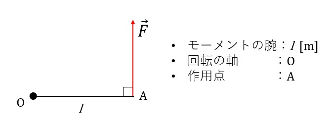

# 回転する部品の運動について
> ここでは、回転する部品に関する知識について説明する。
# モーメント
　モーメントとは、物体を回転させようとする力のことである。
## モーメントを扱う上で必要な用語
　図１　モーメントを扱う上で必要な用語
### モーメントの腕
モーメントの腕とは、図１でいうと、かかる力 $\vec{F}$ の作用線と回転の中心の距離のことである。図１では働いている力 $\vec{F}$ は線分OAに垂直なので、モーメントの腕 $l$ の長さは線分OAの長さに等しい。

## モーメントの定義
モーメントは、「***腕の長さ*** と ***かかる力*** の積」と定義されている。また、単位は $[N・m]$ を用いる。
$$N = |\vec{F}| ・ l　[N・m]$$
## 少し複雑な図でのモーメントの求め方
#### 例題 １
点Oを回転の中心とする軽い棒がある。点Aに力 $\vec{F}$ がかかっている。この時のモーメントを求めよ

　図2　例題の図

＜解説＞
ここでは数ある求め方の中からひとつ解説する。ほかのやり方については各自で見つけるといい。
　まず、モーメントの腕 $l$ を、線分OAの長さと角度 $θ$ を用いて表す。
　$$ l = OA・cosθ$$
　これで腕の長さが分かったのでモーメント $N$ を求める。
　$$N = OA・cosθ・|\vec{F}|$$

## モーメントの使い方
例として車輪を上げて説明する。