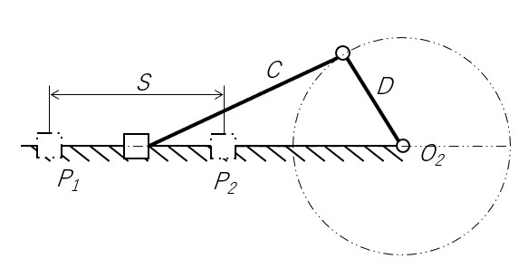

# スライダクランク機構
スライダクランク機構は、往復運動と回転運動を行う代表的な機構である。てこクランクきこうは、最短リンク B を限りなく短くし、リンク A 上をスライドできるようにすることで作れる。そのため、リンクの本数が４本より短く見える。

## スライダクランク機構の理論
スライダクランク機構を使う上で知っておきたい理論がある。
### 上死点と下死点
上死点とは、スライダクランク機構が動く途中で、スライドするリンク P がクランク D の回転の中心 (O_2)  から最も遠くなる点（P_1）のことだ。また、下死点はその逆で、点 O_2に最も近くなる点 (P_2) のことである。

### ストローク
ストローク (S) とは、上死点と下死点の距離のことだ。

上死点と下死点の位置・ストロークはそれぞれ計算で求めることが出来る。
上死点は、リンク C とリンク D が一直線上にあり、この２つのリンクが重なっていないときなので、上死点 P_1 から O_2 の距離は、(リンク C の長さ) + (リンク D の長さ) となる。下死点は、同一直線上かつ、重なっている時なので、(リンク C の長さ) - (リンク D の長さ) となる。ストロークは、２× (リンク D の長さ) になる。

[両てこ機構について](about-double-teko.md) <= 前へ　|　次に => [カム機構](about-cam-mechanism.md)

[シラバスに戻る](syllabus.md)