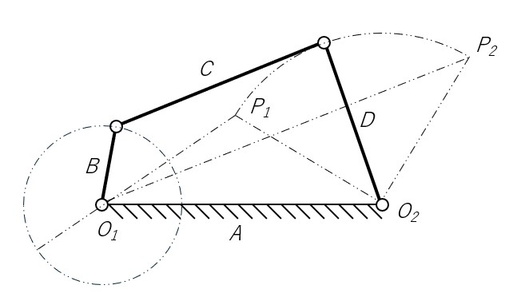

# てこクランク機構
てこクランク機構は、4本のリンク（A,B,C,D）のうち、最短リンク B をクランクとし、リンク A を固定し、グラスホフの定理に当てはまっている。

### グラスホフの定理
グラスホフの定理とは、てこクランク機構の成立条件のことである。以下の不等式が成り立たなければ、てこクランク機構にはならない。

>B + A < C + D
>B + C < A + D
>B + D < A + C

この式、すなわち最短リンク（B）とそれ以外のどれかのリンクの長さを足し合わせたものは、残りの２つのリンクの長さを足し合わせたものは、残りの２つのリンクの長さを足したものよりも小さくなる。

[リンク機構について](about-link-mechanism.md) <= 前へ　|　次に => [両クランク機構について](about-double-crank.md)
[シラバスに戻る](syllabus.md)